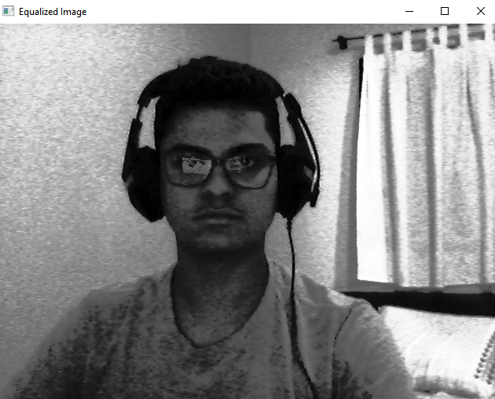
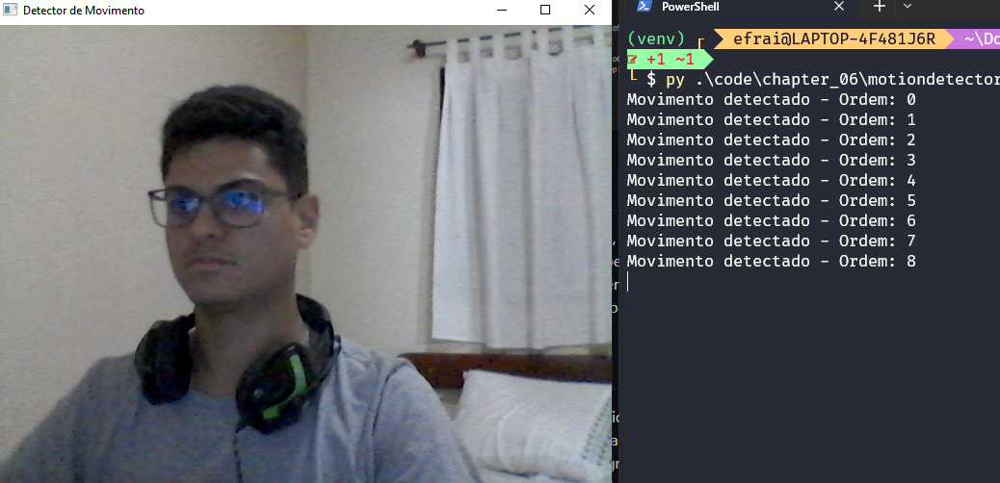

= DCA0445: Processamento Digital de Imagens =

Efrain Marcelo <efrainmpp@gmail.com>

== Questões Capitulo 6 - Manipulando Histogramas ==

=== Exercício 1  ===

Implemente um programa equalize.py. Este deverá, para cada imagem capturada, realizar a 
equalização do histogram antes de exibir a imagem. Teste sua implementação apontando a 
câmera para ambientes com iluminações variadas e observando o efeito gerado. Assuma que as 
imagens processadas serão em tons de cinza.

[source,python]
----	
include::code/chapter_06/equalize.py[title="equalize.py"]
----

=== Exercício 2 ===

Implemente um programa motiondetector.cpp. Este deverá continuamente calcular o histograma 
da imagem (apenas uma componente de cor é suficiente) e compará-lo com o último histograma 
calculado. Quando a diferença entre estes ultrapassar um limiar pré-estabelecido, ative um 
alarme. Utilize uma função de comparação que julgar conveniente.

[source,python]
----	
include::code/chapter_06/motiondetector.py[title="motiondetector.py"]
----