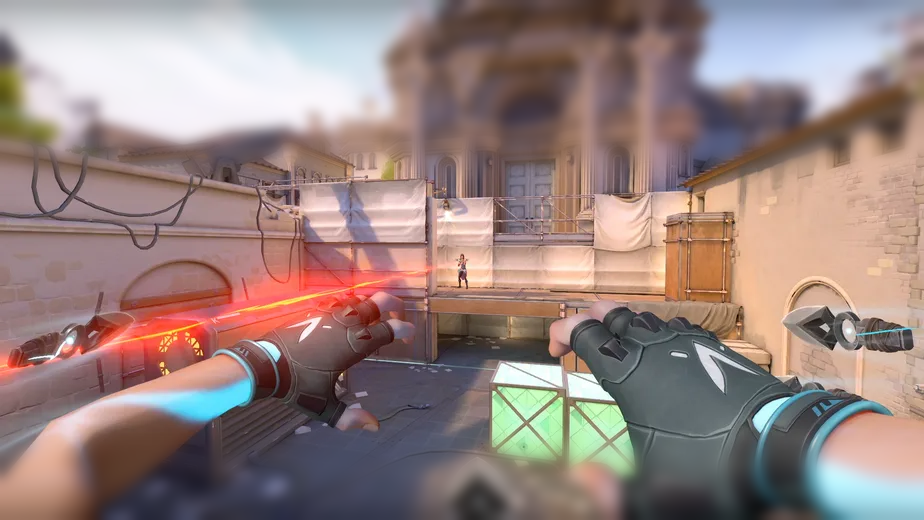
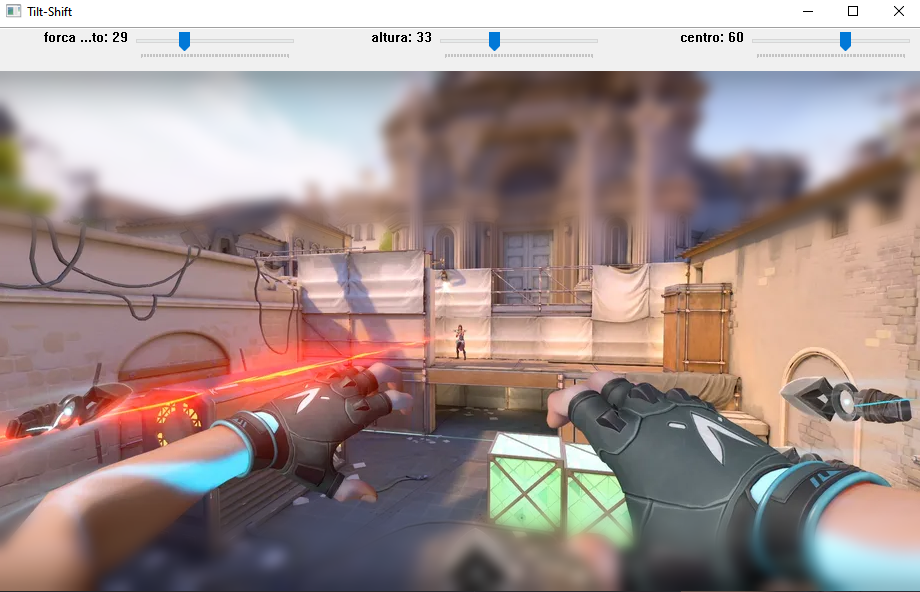

= DCA0445: Processamento Digital de Imagens =

Efrain Marcelo <efrainmpp@gmail.com>

== Questões Capitulo 8 - Filtragem no domínio espacial II ==

=== Exercício 1  ===

Implemente um programa tiltshift.py. Três ajustes deverão ser providos na tela da interface:

- Um ajuste para regular a altura da região central que entrará em foco;

- Um ajuste para regular a força de decaimento da região borrada;

- Um ajuste para regular a posição vertical do centro da região que entrará em foco. Finalizado o programa, a imagem produzida deverá ser salva em arquivo.

[source,python]
----	
include::code/chapter_08/tiltshift.py[title="tiltshift.py"]
----
