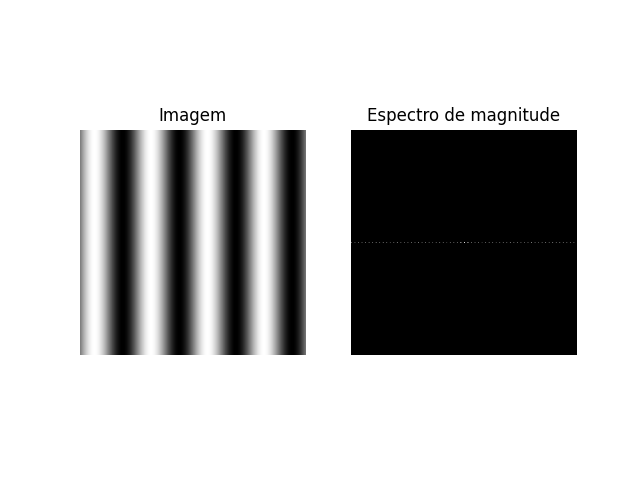
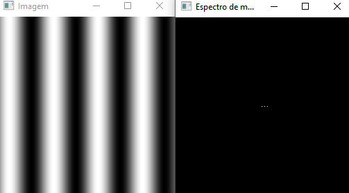

= DCA0445: Processamento Digital de Imagens =

Efrain Marcelo <efrainmpp@gmail.com>

== Questões Capitulo 9 - A Tranformada Discreta de Fourier ==

=== Exercício 1  ===

Calcule e apresente o espectro de magnitude da imagem

[source,python]
----	
include::code/chapter_09/dft_image.py[title="dft_image.py"]
----

=== Exercício 2  ===

Adapte o programa dft_image.py para ler a imagem em ponto flutuante armazenada 
no arquivo YAML equivalente

[source,python]
----	
include::code/chapter_09/dft_image_float.py[title="dft_image_float.py"]
----

=== Exercício 3 ===

Compare o novo espectro de magnitude gerado com o valor teórico da transformada de Fourier da senóide. 
O que mudou para que o espectro de magnitude gerado agora esteja mais próximo do valor teórico? 
Porque isso aconteceu?

No código C++ original, o espectro de magnitude é calculado utilizando a função cv::magnitude(planos[0], planos[1], magn), que retorna a magnitude complexa direta sem a adição da constante 1 ou o cálculo do logaritmo. Por outro lado, no código Python adaptado, adicionamos 1 ao espectro de magnitude e em seguida aplicamos o logaritmo antes de normalizar.

Essas alterações foram feitas para evitar o logaritmo de zero e para comprimir a faixa dinâmica dos valores, a fim de melhorar a visualização. No entanto, essas manipulações modificam a escala e a distribuição dos valores do espectro de magnitude, resultando em diferenças visuais significativas em relação ao valor teórico.

Para obter um resultado mais próximo do valor teórico, você pode remover a adição da constante 1 e o logaritmo do cálculo do espectro de magnitude no código Python. Dessa forma, o espectro de magnitude gerado será mais semelhante ao valor teórico da transformada de Fourier da senoide.

É importante mencionar que o espectro de magnitude gerado pelo código representa a magnitude da transformada de Fourier da imagem, mas não é idêntico ao valor teórico da transformada de Fourier de uma senoide pura. A diferença é esperada devido às características específicas da imagem processada e às transformações aplicadas durante o cálculo e visualização do espectro.